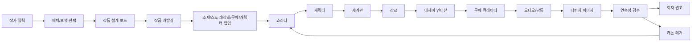

# Story X Agent System

## Goal

Story X is an AI-assisted creative harness for novels, essays, audiobooks, comics, and serial formats. The system treats continuity, personal voice, listening rhythm, and story quality as structured state. Every generation run must read the right memory anchors, ask for missing lived material when needed, validate contradictions, and write new canon, voice, or audio facts back to the ledger.

## Product Thesis

Story X does not start with "write me a draft." It starts with the story. The service mixes three AI resource layers:

- `Text`: premise, prose, essay, dialogue, script, caption, lyrics
- `Image`: character reference, storyboard, panel, illustration, visual motif
- `Sound`: narration, voice tone, music cue, rhythm, sound effect

Harness engineering decides how those resources are assembled. Story craft decides whether the result is worth assembling.

The intended loop is:

1. Build a strong story core.
2. Validate character, world, voice, and continuity.
3. Produce one medium well.
4. Offer the next natural transformation.
5. Preserve the same story core across every transformed output.

Examples:

- A novel can become an audiobook, screenplay, webtoon board, or video-cut plan.
- An essay can become a published post, narrated audio, audiobook piece, or video essay.
- A comic can become cut-by-cut images, a motion storyboard, or later a video AI sequence.
- A children's reading can combine text, sound, repetition, subtitles, and gentle visuals.

The brand promise is simple: the output may change form, but the story should not become weaker.

## Runtime Shape

## State Model

- `CreativeBlueprint`: medium, format, management focus, agent stack, skill stack, production phases
- `CreativeDevelopmentPackage`: material, story arc, character cards, visual/prose plan, panel plan, image prompt plan, story contract, workflow board, quality gates, refactor impact preview, reference DNA cards, AI output autopsy, agent reports, **M4: storyOntology · harnessReport · mediaProjections · continuityContract**

## M4 신설 에이전트 12명 (Stage × Media Matrix)

M4-essay-studio-agents 와 M4-stage-agents 에서 신설된 12 에이전트. `ValidationAgentId` 23개 중 신설 12개.

### 스튜디오 단계 코어 6명

| Agent | 역할 | 주요 활동 |
|---|---|---|
| `canon-librarian` | 캐논 사서 | 캐논 사실 분류·인덱싱·정합 검증 |
| `timeline-keeper` | 시간선 키퍼 | 회차 순서·예고·복선 스케줄 관리 |
| `bible-curator` | 바이블 큐레이터 | 13 카테고리 바이블 패킷 구성·핀 관리 |
| `critic-reviewer` | 작품성 평론가 | 양가성·윤리적 비용·침묵·모티프 변주 (작품성 트랙) |
| `essay-curator` | 에세이 큐레이터 | 진실 계약·사적→보편 도약·노출 윤리 (에세이) |
| `memory-evolution-keeper` | 메모리 성장 키퍼 | evolutionMemory 누적·압축·drift 감지 |

### 랜딩 단계 1명

| Agent | 역할 |
|---|---|
| `studio-architect` | 매체 선택·스튜디오 구성 제안 |

### 브릿지 단계 1명

| Agent | 역할 |
|---|---|
| `interview-curator` | 자유글·매체·길이를 보고 매체별 페르소나 풀에서 라인업 선정 |

### 출판 단계 4명

| Agent | 역할 |
|---|---|
| `book-designer` | 표지·내부·CMYK PDF·EPUB 3 |
| `pr-specialist` | 보도자료·소셜·플랫폼 메타데이터·D-7~D+14 시퀀스 |
| `platform-curator` | Kindle/Ridi/Yes24, 네이버/카카오, 윌라/Audible |
| `business-strategist` | 가격·로열티·독점·라이선스·ROI |

### 16 craft 검토 기준 (criteriaKeys)

각 에이전트의 `AgentValidationProcess.criteriaKeys` 에 등록됨 (M4 청크 F).

| Agent | criteriaKeys |
|---|---|
| `serial-showrunner` | chapter_one_hook_check · chapter_end_hook_check · stakes_progression_audit |
| `character-custodian` | pressure_triangle_validation · flat_character_warning |
| `world-keeper` | motif_variation_audit · historical_consistency_extended |
| `genre-stylist` | scene_sequel_ratio · voice_match_score · read_aloud_audit |
| `continuity-editor` | open_threads_overload |
| `critic-reviewer` | ambiguity_audit · ethical_pressure_test · silence_audit |
| `essay-curator` | universal_leap_check · self_reversal_check · disclosure_scope_check |

- `TesterDrivenWorkflow`: evaluator-informed workflow board with activation metric, role ownership, quality gates, platform proof, and approval rule
- `VoiceBible`: author style preferences, sentence rhythm, metaphor density, forbidden phrases, Korean naturalness flags
- `EssayMemory`: user-supplied lived material, surrounding people, privacy boundaries, reflective questions
- `AudioPlan`: narrator voice, pacing, music cues, sound effects, captions, scene rhythm
- `SeriesProject`: title, logline, genre, tone, audience promise, current episode
- `CharacterProfile`: role, desire, wound, current state, voice rules, forbidden contradictions
- `WorldRule`: rule text and contradictions that must be blocked
- `CanonFact`: episode-scoped facts owned by character, world, or plot
- `Chapter`: outline, prose, memory anchors, new canon facts

## Agent Responsibilities

| Agent | Responsibility | Output |
| --- | --- | --- |
| `serial-showrunner` | Episode promise, escalation, cliffhanger | Beat contract |
| `character-custodian` | Desire, wound, voice, relationship continuity | Character deltas |
| `world-keeper` | Setting rules, magic limits, chronology | World constraints |
| `genre-stylist` | Genre rhythm and prose texture | Scene style pass |
| `essay-interviewer` | Questions the writer about lived experience without inventing personal material | Interview packet |
| `voice-curator` | Author voice bible, Korean naturalness, style consistency | Voice report |
| `audio-narration-director` | Voice tone, pacing, pauses, emphasis, listener attention | Narration sheet |
| `education-video-architect` | Learning objective, explanation sequence, examples, captions | Teaching sequence |
| `sound-music-agent` | Hooks, motifs, repeated lines, music and sound cues | Cue sheet |
| `continuity-editor` | Contradiction checks and canon updates | Approval report |
| `storyboard-agent` | Panel, cut, page, carousel, and scroll rhythm for comics | Visual sequence |
| `speech-bubble-agent` | Speech bubble density, style, and position | Bubble plan |
| `davinci-image-agent` | FLUX.2-ready cut-by-cut image prompt generation | Prompt set |
| `frame-assembly-agent` | Square frame or carousel composition | Export brief |

## Evaluator Feedback Loop

The evaluator agent does not add more voices to the creative room. It compresses tester feedback into service-safe rules:

1. Keep the north star: one story can change form without losing its soul.
2. Convert tester complaints into P0 product structures: Workflow Board, Story Contract, Refactor Impact Preview, Quality Gates, Reference DNA Cards, AI Output Autopsy.
3. Assign each structure to a small number of owner agents.
4. Preserve conflicts instead of smoothing them over. Canon contradictions are blocked, not passed by majority vote.
5. Require user approval before new canon or memory updates enter the memory bank.

## Expansion Path

1. Replace the local deterministic prose composer with an LLM endpoint.
2. Persist `SeriesProject` in a database instead of localStorage.
3. Add per-series bibles and branchable alternate drafts.
4. Add import/export for Markdown, Fountain, EPUB, and carousel brief workflows.
5. Add reviewer modes for web novel, essay, screenplay, literary fiction, insta-toon, and game narrative.
